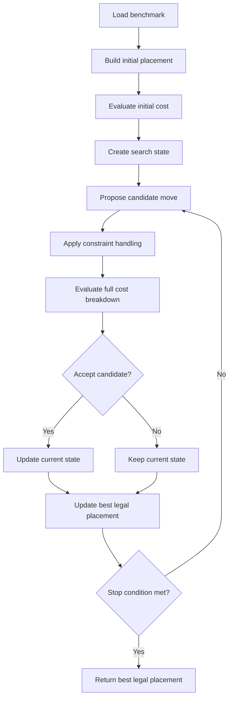

# Macro Placement Optimizer Proxy-Cost Design

## Goal

Design the optimizer framework around the full proxy-cost from the beginning, so later algorithm changes do not require rewriting the search loop.

The optimizer should search for a legal macro placement that minimizes:

```text
official_proxy =
    1.0 * wirelength_cost
  + 0.5 * density_cost
  + 0.5 * congestion_cost
```

In addition to the official proxy, the search process should also track legality terms such as overlap and boundary violations.

## Problem Model

### Variables

Each movable macro has a center coordinate:

```text
P = {(x_i, y_i) | i is a movable macro}
```

The placement tensor stores one `(x, y)` center position per macro.

### Hard Constraints

The final placement should satisfy:

```text
1. Every macro is inside the canvas.
2. Hard macros do not overlap.
3. Any future spacing, halo, fence, or region rule can be added as another legality check.
```

Soft macros may overlap depending on benchmark semantics, but hard macro overlap should be treated as invalid for final output.

### Search Objective

Use a unified search score:

```text
search_score =
    official_proxy
  + legality_penalty
```

where:

```text
official_proxy =
    w_wl   * wirelength_cost
  + w_den  * density_cost
  + w_cong * congestion_cost
```

and:

```text
legality_penalty =
    w_overlap  * overlap_penalty
  + w_boundary * boundary_penalty
  + optional future constraint penalties
```

Recommended official weights:

```text
wirelength = 1.0
density    = 0.5
congestion = 0.5
```

Recommended search-only legality weights:

```text
overlap  = very large
boundary = very large
```

The official proxy should stay reportable separately from the search score.

## Cost Terms

### Wirelength Cost

Measures normalized HPWL across the netlist.

Intuition:

```text
Strongly connected macros should be closer together.
Lower wirelength is better.
```

### Density Cost

Measures density pressure across grid cells, with emphasis on the densest cells.

Intuition:

```text
Macros should not be packed too tightly into local regions.
Lower density cost is better.
```

Density also implicitly penalizes overlap because overlapping macros increase local density.

### Congestion Cost

Measures estimated routing congestion, emphasizing the most congested routing regions.

Intuition:

```text
The placement should leave usable routing space.
Lower congestion cost is better.
```

### Overlap Metrics

Overlap should be tracked separately from the official proxy:

```text
overlap_count
total_overlap_area
max_overlap_area
num_macros_with_overlaps
overlap_ratio
```

Even if a placement has a low official proxy, it should not be accepted as the final best placement if it has hard macro overlap.

## From Placement To Scalar Cost

This section describes how one placement tensor becomes the scalar numbers used by the optimizer.

Input:

```text
placement:
    shape = [num_macros, 2]
    placement[i] = (x_i, y_i), the center position of macro i
```

The evaluator first writes these positions into the `PlacementCost` object. For hard macro pins, the pin position is updated as:

```text
pin_x = parent_macro_x + pin_offset_x
pin_y = parent_macro_y + pin_offset_y
```

Ports use their own fixed positions. Soft macro pins are also resolved through their parent soft macro position.

After this synchronization, all cost terms are computed from the same placement.

### Wirelength Formula

For each net `n`, collect all pin or port positions belonging to that net:

```text
S_n = {(x_p, y_p) | p is a source or sink pin/port on net n}
```

Compute the net bounding box:

```text
x_min(n) = min x_p over p in S_n
x_max(n) = max x_p over p in S_n
y_min(n) = min y_p over p in S_n
y_max(n) = max y_p over p in S_n
```

The net HPWL is:

```text
hpwl(n) =
    [x_max(n) - x_min(n)]
  + [y_max(n) - y_min(n)]
```

The implementation multiplies each net HPWL by the source pin weight:

```text
weighted_hpwl(n) = weight(n) * hpwl(n)
```

The raw total wirelength is:

```text
total_hpwl = sum weighted_hpwl(n) over all nets
```

The normalized wirelength cost is:

```text
wirelength_cost =
    total_hpwl
  / [(canvas_width + canvas_height) * net_count]
```

where `net_count` is the net count used by `PlacementCost`.

So the placement affects wirelength through macro and pin coordinates. Moving a macro changes the positions of its pins, which changes net bounding boxes, which changes the final normalized HPWL scalar.

### Density Formula

The canvas is divided into a grid:

```text
grid_cols * grid_rows
```

Each grid cell has:

```text
grid_width  = canvas_width  / grid_cols
grid_height = canvas_height / grid_rows
grid_area   = grid_width * grid_height
```

For every hard macro and soft macro, form its rectangle:

```text
macro_box(i) =
    [x_i - w_i/2, x_i + w_i/2]
  x [y_i - h_i/2, y_i + h_i/2]
```

For each grid cell `g`, compute how much macro area overlaps that cell:

```text
occupied_area(g) =
    sum area(macro_box(i) intersect grid_box(g))
    over all hard and soft macros i
```

Grid density is:

```text
density(g) = occupied_area(g) / grid_area
```

Then sort all nonzero grid densities from high to low. Let:

```text
N = grid_rows * grid_cols
k = floor(0.1 * N)
```

The density cost is the average of the top 10% densest grid cells, with an internal 0.5 factor:

```text
density_cost =
    0.5 * average(top k values of density(g))
```

If the grid has fewer than 10 cells, the implementation averages occupied cells instead.

Important implication:

```text
Overlapping macros can produce density(g) > 1.0.
```

So density can penalize overlap indirectly, but hard macro overlap should still be tracked as a separate legality constraint.

### Congestion Formula

Congestion is grid-based. The evaluator maps pins to grid cells and estimates how much horizontal and vertical routing demand crosses each grid cell.

For each net:

```text
1. Map source and sink pin coordinates to grid cells.
2. Remove duplicate grid cells for that net.
3. Route the grid-level net using simple L/T/two-pin style patterns.
4. Add the net weight to horizontal or vertical routing demand on crossed grid cells.
```

This produces two raw arrays:

```text
H_routing_demand(g)
V_routing_demand(g)
```

Each grid cell also has routing capacity:

```text
grid_h_routes = grid_height * hroutes_per_micron
grid_v_routes = grid_width  * vroutes_per_micron
```

The normalized routing congestion is:

```text
H_routing_cong(g) = H_routing_demand(g) / grid_h_routes
V_routing_cong(g) = V_routing_demand(g) / grid_v_routes
```

Hard macros also consume routing resources. For each hard macro, the evaluator computes its overlap with grid cells and adds macro routing blockage terms:

```text
H_macro_cong(g)
V_macro_cong(g)
```

The net-routing congestion is smoothed before macro congestion is added:

```text
V routing congestion is spread horizontally over nearby columns.
H routing congestion is spread vertically over nearby rows.
```

Final per-cell congestion is:

```text
H_total_cong(g) = H_smoothed_routing_cong(g) + H_macro_cong(g)
V_total_cong(g) = V_smoothed_routing_cong(g) + V_macro_cong(g)
```

The evaluator concatenates the vertical and horizontal congestion arrays:

```text
C = [V_total_cong(all grid cells), H_total_cong(all grid cells)]
```

Then it takes the average of the top 5% values:

```text
congestion_cost = average(top floor(0.05 * len(C)) values of C)
```

If that top-count is zero, the implementation uses the maximum value.

So the placement affects congestion through:

```text
macro pin grid locations
net grid-level routes
macro routing blockage over grid cells
```

### Overlap Formula

Overlap metrics are computed only for hard macro pairs.

For macro `i`:

```text
left_i   = x_i - w_i/2
right_i  = x_i + w_i/2
bottom_i = y_i - h_i/2
top_i    = y_i + h_i/2
```

For a pair `(i, j)`:

```text
overlap_x =
    max(0, min(right_i, right_j) - max(left_i, left_j))

overlap_y =
    max(0, min(top_i, top_j) - max(bottom_i, bottom_j))
```

The pair overlaps if:

```text
overlap_x > 0 and overlap_y > 0
```

The overlap area is:

```text
overlap_area(i, j) = overlap_x * overlap_y
```

The reported overlap metrics are:

```text
overlap_count              = number of hard macro pairs with positive overlap
total_overlap_area         = sum overlap_area(i, j)
max_overlap_area           = max overlap_area(i, j)
num_macros_with_overlaps   = number of macros involved in at least one overlap
overlap_ratio              = num_macros_with_overlaps / num_macros
```

### Boundary Violation Formula

Boundary violation is not part of the official proxy, but the search framework should compute it as a legality term.

For each macro:

```text
left_overflow   = max(0, -(x_i - w_i/2))
right_overflow  = max(0,  x_i + w_i/2 - canvas_width)
bottom_overflow = max(0, -(y_i - h_i/2))
top_overflow    = max(0,  y_i + h_i/2 - canvas_height)
```

One simple scalar penalty is:

```text
boundary_penalty =
    sum over macros [
        left_overflow
      + right_overflow
      + bottom_overflow
      + top_overflow
    ]
```

Another stricter version squares the overflow distances:

```text
boundary_penalty_l2 =
    sum over macros [
        left_overflow^2
      + right_overflow^2
      + bottom_overflow^2
      + top_overflow^2
    ]
```

For final output, boundary violation should be zero.

### Final Scalar Used By Search

The official scalar is:

```text
official_proxy =
    1.0 * wirelength_cost
  + 0.5 * density_cost
  + 0.5 * congestion_cost
```

The optimizer's internal scalar can include legality:

```text
search_score =
    official_proxy
  + w_overlap  * overlap_penalty
  + w_boundary * boundary_penalty
```

The recommended final-selection rule is:

```text
Only legal placements can become best_final.
Among legal placements, choose the one with the lowest official_proxy.
```

## Cost Breakdown Object

Every evaluation should return a structured breakdown:

```text
CostBreakdown:
    search_score
    official_proxy
    wirelength_cost
    density_cost
    congestion_cost
    overlap_count
    total_overlap_area
    boundary_violation
    legality_penalty
    is_legal
```

The optimizer should make decisions using `search_score` and `is_legal`, while logs and reports should include all individual terms.

## Acceptance Policy

The acceptance policy should compare both quality and legality.

Recommended decision order:

```text
1. If candidate is legal and current is illegal:
       prefer candidate.

2. If candidate is illegal and current is legal:
       reject candidate unless the selected algorithm explicitly allows temporary illegal states.

3. If both are legal:
       compare official_proxy or search_score.

4. If both are illegal:
       compare legality_penalty first, then proxy.
```

This prevents the optimizer from keeping an apparently good but invalid low-wirelength placement.

## Main Components

### PlacementState

Owns:

```text
placement tensor
movable indices
macro sizes
cached CostBreakdown
legal or illegal status
```

### CostEvaluator

Responsible for:

```text
evaluate(placement) -> CostBreakdown
compute wirelength_cost
compute density_cost
compute congestion_cost
compute overlap and boundary penalties
combine terms into official_proxy and search_score
```

The rest of the optimizer should not know how each cost is computed.

### MoveGenerator

Responsible for proposing candidate placement changes.

Examples of move types:

```text
single macro shift
macro swap
group move
region-level move
connectivity-aware move
```

The framework should allow replacing the move generator without changing the cost evaluator.

### ConstraintHandler

Responsible for legality handling:

```text
keep macros inside canvas
detect hard macro overlap
repair candidate placement if the chosen strategy supports repair
reject invalid candidates if using hard constraints
```

### AcceptancePolicy

Responsible for deciding whether to move from current state to candidate state.

Different algorithms can plug into this layer:

```text
greedy local search
simulated annealing
tabu search
beam search
evolutionary search
RL-driven policy
```

### BestTracker

Responsible for saving the best legal placement seen so far.

Important rule:

```text
Only legal placements should become final best placements.
```

The current state may be temporarily illegal if the algorithm allows it, but the returned placement should be legal.

### Logger

Record individual terms instead of only one scalar score:

```text
iteration
search_score
official_proxy
wirelength_cost
density_cost
congestion_cost
overlap_count
total_overlap_area
accepted_moves
best_legal_proxy
```

This makes it easier to diagnose whether an algorithm is improving wirelength while damaging density or congestion.

## High-Level Flow



## Stable Optimizer Loop

The outer loop should remain stable even if the internal algorithm changes:

```text
state = initial_state()
state.cost = evaluator.evaluate(state.placement)
best = state if state.cost.is_legal else None

while budget remains:
    move = move_generator.propose(state)
    candidate = constraint_handler.apply(state, move)
    candidate.cost = evaluator.evaluate(candidate.placement)

    if acceptance_policy.accept(state.cost, candidate.cost):
        state = candidate

    best_tracker.update(state)

return best_tracker.best_legal_placement
```

The parts most likely to change later are:

```text
MoveGenerator
AcceptancePolicy
CostEvaluator performance implementation
ConstraintHandler repair strategy
```

The outer optimizer loop should not need major changes.

## Full vs Cheap Evaluation

The framework should support two evaluation modes while keeping the same interface:

```text
full evaluation:
    wirelength + density + congestion + legality

cheap evaluation:
    faster approximation, possibly wirelength + legality
```

Even if the first version always uses full evaluation, the interface should be ready for cheaper approximations later.

This allows future performance improvements without changing the optimizer architecture.

## Recommended Development Order

1. Define `CostBreakdown` and `CostEvaluator` around all official proxy terms.
2. Add legality terms and make `is_legal` explicit.
3. Build the optimizer loop around `PlacementState`, `MoveGenerator`, `ConstraintHandler`, `AcceptancePolicy`, and `BestTracker`.
4. Start with a simple move generator and simple acceptance policy.
5. Add logging for all cost components.
6. Replace the search policy later without changing the cost framework.

## Key Design Rule

Do not build the search framework around only wirelength.

The decision layer should always receive:

```text
wirelength_cost
density_cost
congestion_cost
legality information
combined search_score
```

This keeps the framework compatible with future simulated annealing, local search, or hybrid optimizers without redesigning the cost path.
