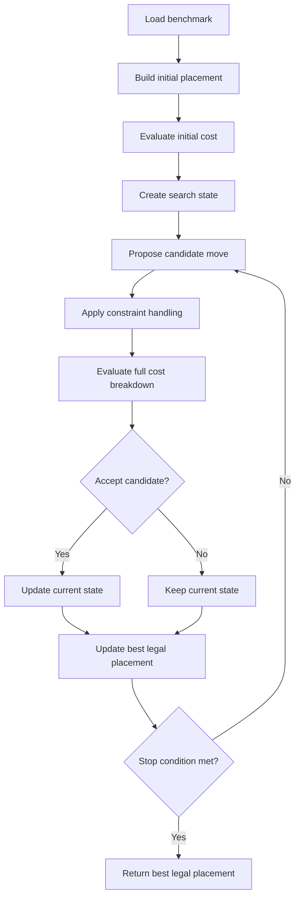

# Macro Placement Optimizer Proxy-Cost 设计说明

## 目标

从一开始就围绕完整的 proxy-cost 设计 optimizer 框架，避免后续从只优化 wirelength 扩展到 density、congestion 时重写搜索主循环。

optimizer 的目标是寻找一个合法 macro placement，使下面的官方 proxy 尽量低：

```text
official_proxy =
    1.0 * wirelength_cost
  + 0.5 * density_cost
  + 0.5 * congestion_cost
```

除了官方 proxy，搜索过程中还应该单独跟踪合法性指标，例如 overlap 和 boundary violation。

## 问题建模

### 变量

每个可移动 macro 都有一个中心坐标：

```text
P = {(x_i, y_i) | i 是一个 movable macro}
```

placement tensor 中每一行保存一个 macro 的 `(x, y)` 中心位置。

### 硬约束

最终 placement 应满足：

```text
1. 每个 macro 都在 canvas 内。
2. hard macro 之间不能重叠。
3. 未来如果有 spacing、halo、fence、region 等规则，可以作为额外合法性检查加入。
```

soft macro 是否允许 overlap 取决于 benchmark 语义，但 hard macro overlap 应该被视为最终输出非法。

### 搜索目标

搜索过程中使用统一的 score：

```text
search_score =
    official_proxy
  + legality_penalty
```

其中：

```text
official_proxy =
    w_wl   * wirelength_cost
  + w_den  * density_cost
  + w_cong * congestion_cost
```

以及：

```text
legality_penalty =
    w_overlap  * overlap_penalty
  + w_boundary * boundary_penalty
  + optional future constraint penalties
```

推荐官方权重：

```text
wirelength = 1.0
density    = 0.5
congestion = 0.5
```

推荐搜索内部合法性权重：

```text
overlap  = very large
boundary = very large
```

注意：`official_proxy` 应该和 `search_score` 分开记录，方便最后按官方指标报告。

## Cost 项

### Wirelength Cost

衡量 netlist 的 normalized HPWL。

直觉：

```text
连接关系强的 macro 应该靠近。
wirelength 越低越好。
```

### Density Cost

衡量 grid cell 中的局部密度压力，重点关注最密的区域。

直觉：

```text
macro 不应该过度堆在局部区域。
density cost 越低越好。
```

density 会隐式惩罚 overlap，因为重叠会提高局部 grid density。

### Congestion Cost

衡量估计 routing congestion，重点关注最拥堵的 routing 区域。

直觉：

```text
placement 应该给 routing 留出空间。
congestion cost 越低越好。
```

### Overlap Metrics

overlap 应该独立于官方 proxy 单独记录：

```text
overlap_count
total_overlap_area
max_overlap_area
num_macros_with_overlaps
overlap_ratio
```

即使一个 placement 的 official proxy 很低，只要 hard macro 有 overlap，也不应该作为最终 best placement。

## 从 Placement 到标量 Cost

本节说明一个 placement tensor 如何变成 optimizer 使用的标量数值。

输入：

```text
placement:
    shape = [num_macros, 2]
    placement[i] = (x_i, y_i)，表示 macro i 的中心坐标
```

evaluator 会先把这些位置写入 `PlacementCost` 对象。对于 hard macro pin，pin 位置更新为：

```text
pin_x = parent_macro_x + pin_offset_x
pin_y = parent_macro_y + pin_offset_y
```

port 使用自己的固定位置。soft macro pin 也通过父 soft macro 的位置解析。

完成同步后，所有 cost 项都基于同一个 placement 计算。

### Wirelength 公式

对于每个 net `n`，收集这个 net 上所有 pin 或 port 的位置：

```text
S_n = {(x_p, y_p) | p 是 net n 的 source 或 sink pin/port}
```

计算 net 的 bounding box：

```text
x_min(n) = min x_p over p in S_n
x_max(n) = max x_p over p in S_n
y_min(n) = min y_p over p in S_n
y_max(n) = max y_p over p in S_n
```

该 net 的 HPWL 为：

```text
hpwl(n) =
    [x_max(n) - x_min(n)]
  + [y_max(n) - y_min(n)]
```

实现中会乘以 source pin 的 weight：

```text
weighted_hpwl(n) = weight(n) * hpwl(n)
```

总线长为：

```text
total_hpwl = sum weighted_hpwl(n) over all nets
```

归一化后的 wirelength cost 为：

```text
wirelength_cost =
    total_hpwl
  / [(canvas_width + canvas_height) * net_count]
```

其中 `net_count` 是 `PlacementCost` 使用的 net 数量。

所以 placement 影响 wirelength 的路径是：

```text
macro 坐标变化
-> macro pin 坐标变化
-> net bounding box 变化
-> normalized HPWL 标量变化
```

### Density 公式

canvas 会被划分成 grid：

```text
grid_cols * grid_rows
```

每个 grid cell 的尺寸为：

```text
grid_width  = canvas_width  / grid_cols
grid_height = canvas_height / grid_rows
grid_area   = grid_width * grid_height
```

对于每个 hard macro 和 soft macro，构造其矩形：

```text
macro_box(i) =
    [x_i - w_i/2, x_i + w_i/2]
  x [y_i - h_i/2, y_i + h_i/2]
```

对于每个 grid cell `g`，计算所有 macro 与该 cell 的重叠面积：

```text
occupied_area(g) =
    sum area(macro_box(i) intersect grid_box(g))
    over all hard and soft macros i
```

grid density 为：

```text
density(g) = occupied_area(g) / grid_area
```

然后将所有非零 grid density 从高到低排序。设：

```text
N = grid_rows * grid_cols
k = floor(0.1 * N)
```

density cost 是 top 10% densest grid cells 的平均值，再乘内部 0.5 系数：

```text
density_cost =
    0.5 * average(top k values of density(g))
```

如果 grid cell 少于 10 个，实现会改为对 occupied cells 求平均。

重要含义：

```text
macro overlap 可能导致 density(g) > 1.0。
```

所以 density 可以间接惩罚 overlap，但 hard macro overlap 仍然应该作为单独合法性约束。

### Congestion 公式

congestion 是基于 grid 的。evaluator 会把 pin 映射到 grid cell，并估算每个 grid cell 上 horizontal 和 vertical routing demand。

对于每个 net：

```text
1. 将 source 和 sink pin 坐标映射到 grid cell。
2. 去掉该 net 中重复的 grid cell。
3. 用简单的 L/T/two-pin 风格 pattern 对 grid-level net 进行估算 routing。
4. 在经过的 grid cell 上增加 horizontal 或 vertical routing demand。
```

得到两个原始数组：

```text
H_routing_demand(g)
V_routing_demand(g)
```

每个 grid cell 也有 routing capacity：

```text
grid_h_routes = grid_height * hroutes_per_micron
grid_v_routes = grid_width  * vroutes_per_micron
```

归一化后的 routing congestion 为：

```text
H_routing_cong(g) = H_routing_demand(g) / grid_h_routes
V_routing_cong(g) = V_routing_demand(g) / grid_v_routes
```

hard macro 也会占用 routing 资源。对于每个 hard macro，evaluator 计算它与 grid cell 的重叠，并加入 macro routing blockage：

```text
H_macro_cong(g)
V_macro_cong(g)
```

net-routing congestion 会先做 smoothing，然后再加 macro congestion：

```text
V routing congestion 会在附近 columns 横向扩散。
H routing congestion 会在附近 rows 纵向扩散。
```

最终每个 cell 的 congestion 为：

```text
H_total_cong(g) = H_smoothed_routing_cong(g) + H_macro_cong(g)
V_total_cong(g) = V_smoothed_routing_cong(g) + V_macro_cong(g)
```

evaluator 会把 vertical 和 horizontal congestion 数组拼接：

```text
C = [V_total_cong(all grid cells), H_total_cong(all grid cells)]
```

然后取 top 5% 的平均值：

```text
congestion_cost = average(top floor(0.05 * len(C)) values of C)
```

如果 top-count 为 0，实现会使用最大值。

所以 placement 影响 congestion 的路径是：

```text
macro pin grid 位置
net 的 grid-level routing 路径
macro 对 grid routing 资源的阻塞
```

### Overlap 公式

overlap metrics 只针对 hard macro pair 计算。

对于 macro `i`：

```text
left_i   = x_i - w_i/2
right_i  = x_i + w_i/2
bottom_i = y_i - h_i/2
top_i    = y_i + h_i/2
```

对于一对 macro `(i, j)`：

```text
overlap_x =
    max(0, min(right_i, right_j) - max(left_i, left_j))

overlap_y =
    max(0, min(top_i, top_j) - max(bottom_i, bottom_j))
```

如果满足：

```text
overlap_x > 0 and overlap_y > 0
```

则这对 macro 发生重叠。

重叠面积为：

```text
overlap_area(i, j) = overlap_x * overlap_y
```

报告的 overlap metrics 包括：

```text
overlap_count              = 有正重叠面积的 hard macro pair 数量
total_overlap_area         = sum overlap_area(i, j)
max_overlap_area           = max overlap_area(i, j)
num_macros_with_overlaps   = 至少参与一次 overlap 的 macro 数量
overlap_ratio              = num_macros_with_overlaps / num_macros
```

### Boundary Violation 公式

boundary violation 不是官方 proxy 的一部分，但 optimizer 搜索框架应该把它作为合法性项计算。

对于每个 macro：

```text
left_overflow   = max(0, -(x_i - w_i/2))
right_overflow  = max(0,  x_i + w_i/2 - canvas_width)
bottom_overflow = max(0, -(y_i - h_i/2))
top_overflow    = max(0,  y_i + h_i/2 - canvas_height)
```

一种简单 scalar penalty 是：

```text
boundary_penalty =
    sum over macros [
        left_overflow
      + right_overflow
      + bottom_overflow
      + top_overflow
    ]
```

更严格的版本可以使用平方项：

```text
boundary_penalty_l2 =
    sum over macros [
        left_overflow^2
      + right_overflow^2
      + bottom_overflow^2
      + top_overflow^2
    ]
```

最终输出时，boundary violation 应该为 0。

### 搜索使用的最终标量

官方标量：

```text
official_proxy =
    1.0 * wirelength_cost
  + 0.5 * density_cost
  + 0.5 * congestion_cost
```

optimizer 内部标量可以加入合法性 penalty：

```text
search_score =
    official_proxy
  + w_overlap  * overlap_penalty
  + w_boundary * boundary_penalty
```

推荐最终选择规则：

```text
只有合法 placement 才能成为 best_final。
在所有合法 placement 中，选择 official_proxy 最低的那个。
```

## Cost Breakdown 对象

每次 evaluation 应返回结构化 breakdown：

```text
CostBreakdown:
    search_score
    official_proxy
    wirelength_cost
    density_cost
    congestion_cost
    overlap_count
    total_overlap_area
    boundary_violation
    legality_penalty
    is_legal
```

optimizer 决策时使用 `search_score` 和 `is_legal`，日志和报告中保留所有分项。

## 接受策略

acceptance policy 应同时比较质量和合法性。

推荐决策顺序：

```text
1. 如果 candidate 合法而 current 非法：
       优先接受 candidate。

2. 如果 candidate 非法而 current 合法：
       拒绝 candidate，除非所选算法明确允许临时非法状态。

3. 如果二者都合法：
       比较 official_proxy 或 search_score。

4. 如果二者都非法：
       先比较 legality_penalty，再比较 proxy。
```

这样可以避免 optimizer 保留一个 wirelength 很低但 overlap 严重的 placement。

## 主模块

### PlacementState

负责保存：

```text
placement tensor
movable indices
macro sizes
cached CostBreakdown
legal or illegal status
```

### CostEvaluator

负责：

```text
evaluate(placement) -> CostBreakdown
compute wirelength_cost
compute density_cost
compute congestion_cost
compute overlap and boundary penalties
combine terms into official_proxy and search_score
```

optimizer 的其他部分不应该关心每个 cost 的内部计算细节。

### MoveGenerator

负责提出 candidate placement 变化。

可选 move 类型：

```text
single macro shift
macro swap
group move
region-level move
connectivity-aware move
```

框架应该允许替换 move generator，而不影响 cost evaluator。

### ConstraintHandler

负责合法性处理：

```text
keep macros inside canvas
detect hard macro overlap
repair candidate placement if the chosen strategy supports repair
reject invalid candidates if using hard constraints
```

### AcceptancePolicy

负责决定是否从 current state 转移到 candidate state。

不同算法可以插入这一层：

```text
greedy local search
simulated annealing
tabu search
beam search
evolutionary search
RL-driven policy
```

### BestTracker

负责保存历史最好合法 placement。

重要规则：

```text
只有合法 placement 可以成为最终输出的 best placement。
```

如果算法允许，current state 可以临时非法，但返回的 placement 应合法。

### Logger

不要只记录一个 scalar score，应记录所有分项：

```text
iteration
search_score
official_proxy
wirelength_cost
density_cost
congestion_cost
overlap_count
total_overlap_area
accepted_moves
best_legal_proxy
```

这样后续才能判断算法是在降低 wirelength 的同时恶化了 density/congestion，还是整体都在改善。

## 总体流程



## 稳定的 Optimizer 主循环

外层 loop 应保持稳定，即使内部算法后续更换：

```text
state = initial_state()
state.cost = evaluator.evaluate(state.placement)
best = state if state.cost.is_legal else None

while budget remains:
    move = move_generator.propose(state)
    candidate = constraint_handler.apply(state, move)
    candidate.cost = evaluator.evaluate(candidate.placement)

    if acceptance_policy.accept(state.cost, candidate.cost):
        state = candidate

    best_tracker.update(state)

return best_tracker.best_legal_placement
```

后续最可能变化的是：

```text
MoveGenerator
AcceptancePolicy
CostEvaluator performance implementation
ConstraintHandler repair strategy
```

外层 optimizer loop 不应该因为这些变化而大改。

## Full Evaluation 与 Cheap Evaluation

框架应支持两种 evaluation mode，但保持同一个接口：

```text
full evaluation:
    wirelength + density + congestion + legality

cheap evaluation:
    faster approximation, possibly wirelength + legality
```

即使第一版总是使用 full evaluation，也应该预留 cheap approximation 的接口。

这样后续做性能优化时，不需要改变 optimizer 架构。

## 推荐开发顺序

1. 定义 `CostBreakdown` 和围绕完整官方 proxy 的 `CostEvaluator`。
2. 加入 legality terms，并显式记录 `is_legal`。
3. 围绕 `PlacementState`、`MoveGenerator`、`ConstraintHandler`、`AcceptancePolicy`、`BestTracker` 建立 optimizer loop。
4. 先使用简单 move generator 和简单 acceptance policy。
5. 加入所有 cost component 的日志。
6. 后续替换搜索策略，而不是重写 cost 框架。

## 关键设计原则

不要把搜索框架只围绕 wirelength 来写。

决策层应该始终拿到：

```text
wirelength_cost
density_cost
congestion_cost
legality information
combined search_score
```

这样框架后续接入 simulated annealing、local search 或 hybrid optimizer 时，不需要重新设计 cost path。
